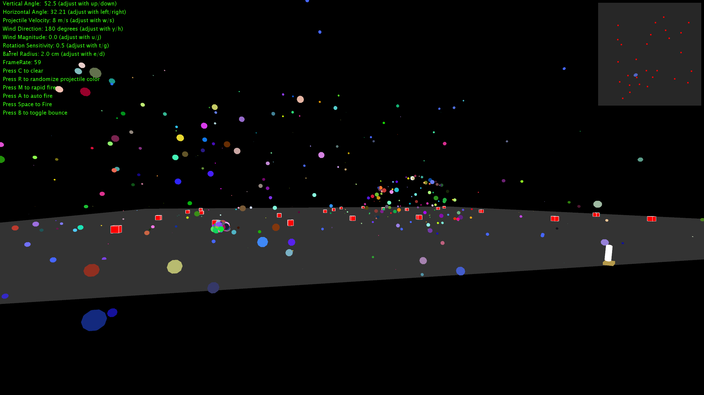
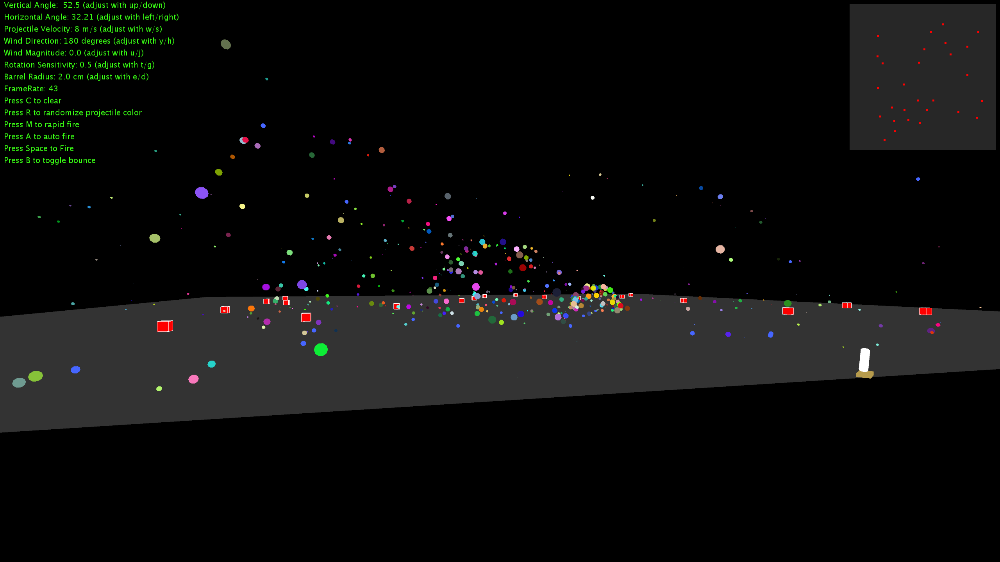
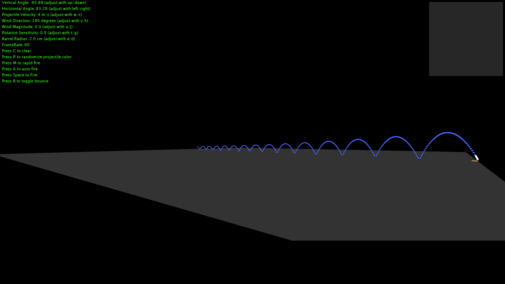
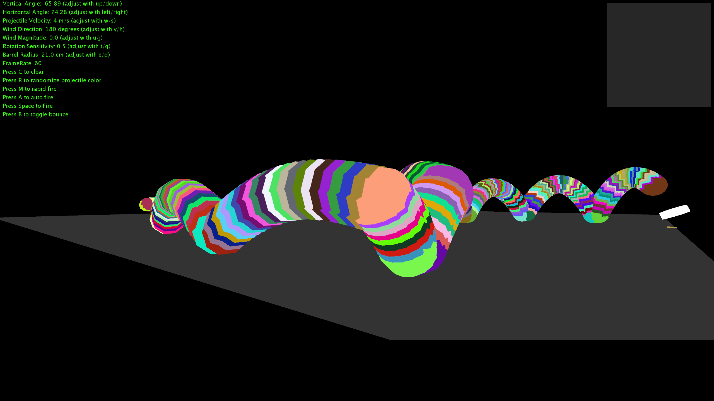
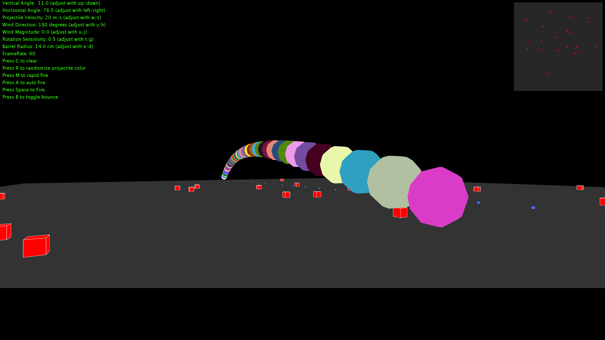

# Cannon-Project
This is a project I did for my Calculus III class to show an example of how Calculus is used in the real world. I created it using [Processing](https://processing.org/) and its intention is to be a simulation of projectile motion in the real world, but has progressed slightly above that. The simulation includes:
- A player-controlled cannon object
- Basic projectile physics
- A variable-width cannon for control over projectile radius
- An easy-to-use camera system using [Peasy-Cam](http://mrfeinberg.com/peasycam/) that allows the user to easily view different angles and perspectives.
- Auto-Fire mode
- A minimap that drops targets onto the terrain
- Particle physics upon particle collision.
- Informative HUD
- Easy user control of variables.
This program could easily be turned into a more robust game or a more realistic simulation. I encourage everyone and anyone to contribute! This has been one of the most fun projects I've developed. 

## Screenshots:

## How to contribute:
1. Download and install the [Processing IDE](https://processing.org/download/)
2. Fork Cannon-Project to your own repository
3. Clone the code to your local machine
4. Open the Processing IDE and open the file called *Mortar_Project.pde*. This will open all of the necessary files.
5. Add the PeasyCam library to your code by going to **Sketch>Import Library...> Add Library...** and search for **PeasyCam** and click **Install**
6. From here you have the freedom to utilize Git to make whatever changes you would like. I encourage you to make changes, add features, fix bugs, improve controls, ETC. Once you make your changes, save and commit your code to your master and push to your GitHub repository before making a pull request. I'll checkout your branch and approve or suggest changes through GitHub. 

THANK YOU!!!!!
